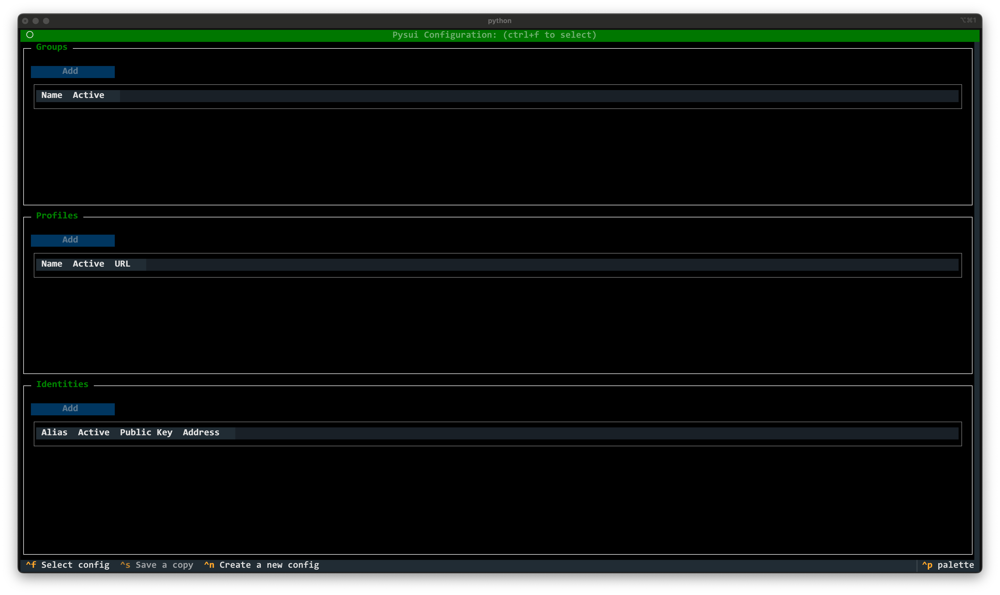

=============================================================
tpysui - Pysui TUI application to manage PysuiConfigurations
=============================================================

ALPHA ALPHA ALPHA

.. contents:: Operations
    :depth: 2

Startup
-------
When you first run ``tpysui`` you are presented with the following screen.
As you can see, the screen is grouped by 3 tables, each of which continas
details of specific sections of the PysuiConfig.json file.

Initial operations:

* ``ctrl+f`` to open a file pickter to load an existing PysuiConfig.json file
* ``ctrl+n`` to create a new PysuiConfig.json file

Once you've opened or created a PysuiConfig.json you can perform changes.

Create new PysuiConfig.json (ctrl+n)
------------------------------------
If you are a first time user of ``pysui`` then you will want to
choose this option.

Open Existing PysuiConfig.json (ctrl+f)
---------------------------------------

Save to a new PysuiConfig.json (ctrl+s)
---------------------------------------
This option is only available after creating or loading a
PysuiConfig.json file.

Adds, Edits, Deletes
--------------------

Add Button
**********
The Add button over each section, when clicked, will popup a relevant
dialog box (i.e. Add Group, Add Profile, Add Identity).

Field Edits
***********
Selecting any field in any table and then pressing ``ctrl+e`` allows
you to change that field.

Delete Rows
***********
Each rown in each section has a ``Delete`` option. Clicking it will
remove the entire row and any relateded content. For example, deleting
a Group will delete all the Profiles and Identities that belong to it.

Deleting the only row in a section is prevented.
