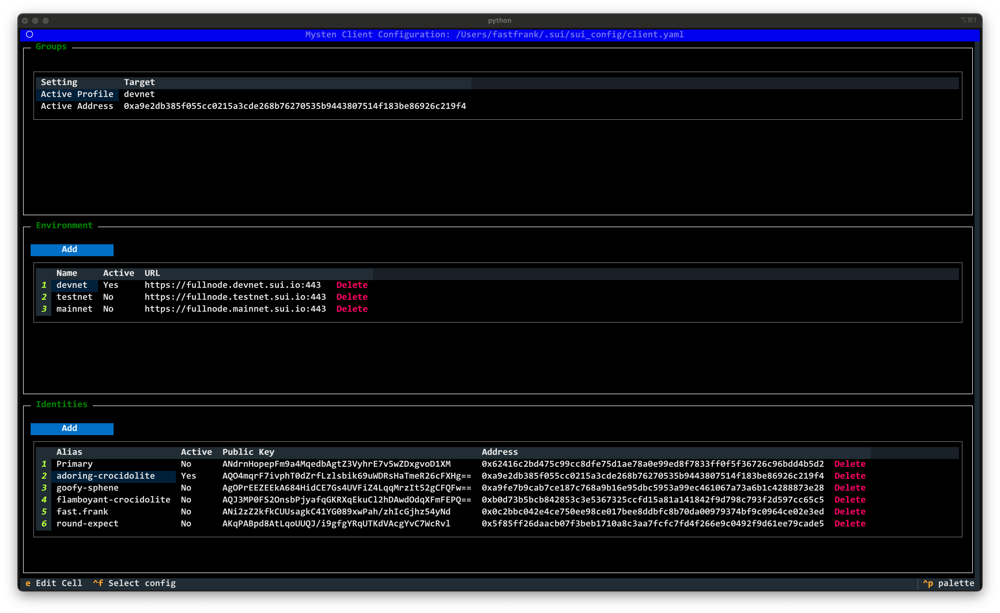

=============================================================
tpysui - Pysui TUI application to manage PysuiConfigurations
=============================================================

ALPHA ALPHA ALPHA

.. contents:: Operations
    :depth: 2

Startup
-------
When you first run ``tpysui`` you are presented with the PysuiConfiguration
management screen screen as shown below.

.. image:: ./main_screen.png
   :width: 800px
   :height: 800px
   :alt: PysuiConfig.json

You can switch between the two configuration types to manage:

* Pressing the "m" key - switches to Mysten Sui client.yaml management screen.
* Pressing the "c" key - switches to PysuiConfiguration management screen.

Example of Mysten Sui (client.yanl) after pressing "m"

Create new config (ctrl+n)
------------------------------------
This is only available in PysuiConfiguration management.

If you are a first time user of ``pysui`` then you will want
to choose this option.

Select an existing configuration (ctrl+f)
-----------------------------------------

This will popup a file picker for selecting a configuration file

For PysuiConfiguration you can select a PysuiConfig.json file.
For Mysten Sui you can select a client.yaml file.

Save a copy (ctrl+s)
--------------------
This is only available for PysuiConfiguration management.

This option is available after creating or loading a PysuiConfig.json file.

Adds, Edits, Deletes
--------------------

Add Button
**********
The Add button over each section, when clicked, will popup a relevant
dialog box (i.e. Add Group, Add Profile, Add Identity).

Adding Identities
^^^^^^^^^^^^^^^^^

The dialog supports generating identies for ED25199, SECP256k1 or SECP256r1

Field Edits
***********
Selecting a field in any table and then pressing the ``e`` key allows
you to change that field.

Groups
^^^^^^
PysuiConfiguration only!

You can change the Name or Active status.

Profiles/Environments
^^^^^^^^^^^^^^^^^^^^^
You can change the Name, Active status and/or URL.

Identities
^^^^^^^^^^
You can change the Alias or Active status.

Delete Rows
***********
Each rown in each section has a ``Delete`` option. Clicking it will
remove the entire row and any relateded content. For example, deleting
a Group will delete all the Profiles and Identities that belong to it.

Deleting the only row in a section is prevented.

Quitting ``tpysui`` (ctrl+q)
----------------------------
Will exit the application and return you to the command line.
