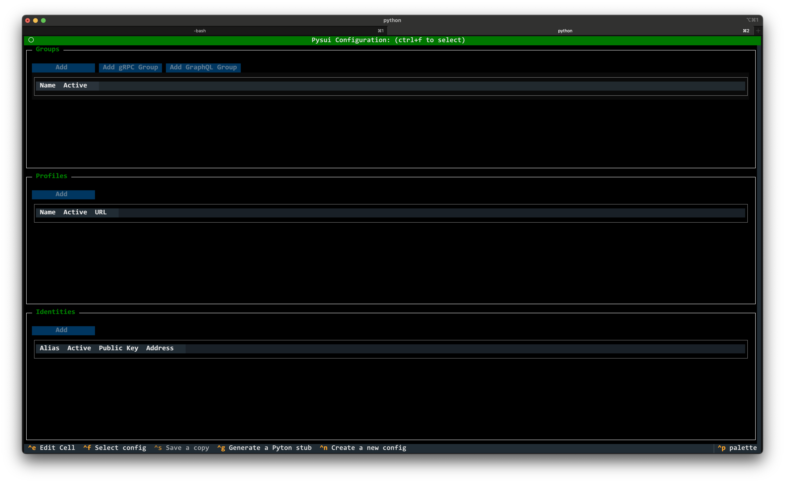

=============================================================
tpysui - Pysui TUI application to manage PysuiConfigurations
=============================================================

ALPHA ALPHA ALPHA

.. contents:: Operations
    :depth: 2

Startup
-------
When you first run ``tpysui`` you are presented with the PysuiConfiguration
management screen screen as shown below.

* Pressing the "m" key - switches to Mysten Sui client.yaml management screen.
* Pressing the "c" key - switches to PysuiConfiguration management screen.

Once you've opened or created a PysuiConfig.json you can perform changes.

Create new config (ctrl+n)
------------------------------------
This is only available in PysuiConfiguration management.

If you are a first time user of ``pysui`` then you will want
to choose this option.

Select an existing configuration (ctrl+f)
-----------------------------------------

Save a copy (ctrl+s)
--------------------
This is only available in PysuiConfiguration management.

This option is available after creating or loading a PysuiConfig.json file.

Adds, Edits, Deletes
--------------------

Add Button
**********
The Add button over each section, when clicked, will popup a relevant
dialog box (i.e. Add Group, Add Profile, Add Identity).

Field Edits
***********
Selecting any field in any table and then pressing ``ctrl+e`` allows
you to change that field.

Delete Rows
***********
Each rown in each section has a ``Delete`` option. Clicking it will
remove the entire row and any relateded content. For example, deleting
a Group will delete all the Profiles and Identities that belong to it.

Deleting the only row in a section is prevented.
